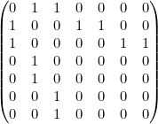
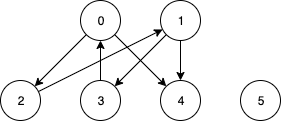

[Solution reference chapter 22](https://sites.math.rutgers.edu/~ajl213/CLRS/Ch22.pdf)

[Official solution reference](https://walkccc.github.io/CLRS/)

Use [mathurl](http://mathurl.com/) to draw math formula 

这一节主要是熟悉如何表示一个图。有两种主要的表示方式：
* adjacent matrix
* adjacent list

adjacent list中的list可以有一些变种，比如，除了list，还可以是BST tree，HashTable，等。

常见的简单的图算法中，adjacent list使用从0开始的index表示顶点，如果关于顶点有其它的属性，那么可以有另外一个平行的list保存这些属性。

#### 22.1-1

Out-degree:
* O(|V| + |E|), if the adjacent list does not record length info
* O(|V|), if the adjacent list record the info of length

In-degree:
* O(|V| + |E|), we can scan all vertices and adjacent lists to get the information 

#### 22.1-2

Adjacent-list representation:

* 1: 2, 3
* 2: 4, 5
* 3: 6, 7

If it's un-directed, we need to add edge of the opposite direction:
* 1: 2, 3
* 2: 1, 4, 5
* 3: 1, 6, 7
* 4: 2
* 5: 2
* 6: 3
* 7: 3

Adjacent-matrix representation:


You can find that from first vertex, each vertex has 2 children, and the children are **i * 2** and **i * 2 + 1**.  

#### 22.1-3

Adjacent-list: **O(|V| + |E|)**

Create a new Adjacent-list and scan the original adjacent-list to construct the new adjacent-list.


Adjacent-matrix:  **O(|V|\*|V|)**

Need to scan all elements in matrix.

#### 22.1-4

Use an Array[|V|] to store whether the edge has already existed. 
Because we don't want to clean the array for each Vertex, we can store the index of Vertex instead of a boolean.  

#### 22.1-5

Adjacent-list:
1. Create a new adjacent-list
2. Scan each vertex *u* in original adjacent-list
3. For each neighbor *v* in the adj[u], get the adj[v], merge adj[v] into adj[u]
- Can use the approach in 22.1-4 to improve the efficiency 

O(|E| * (Average(Degree)))

Adjacent-matrix:
1. Calculate multiply of G and G: O(|V| * |V| * |V|)
2. Then merge G and G*G: G: O(|V| * |V|)
Overall, it's O(|V| * |V| * |V|).

#### 22.1-6

For the i which satisfies universal-sink:
* row i, all be 0
* column i, all be 1 except for the intersection on row and column i

So, for any u(i, j) if i != j. 
* if the value is 0, then i succeeded the test, because row i needs to be 0. 
and j failed the test because column j should be 1 if i != j
* if the value is 1, then j succeeded the test

So each time we choose i and j to test, each time we can get rid of one vertex.


#### 22.1-7

This problem is very easy to mis-understand. For example, the graph below:


The incidence matrix mentioned in problem is not adjacent-matrix.

Adjacent-matrix don't need to use 1 and -1 to represent in and out edge. Because just using matrix has enough information.

Use incidence matrix to represent the graph above. First we have a list of edges:
e02, e04, e13, e14, e21, e30.
The incidence matrix would be |V| * |E|, which is 6 * 6.
```
  e02,e04,e13,e14,e21,e30
0: -1, -1,  0,  0,  0,  1
1:  0,  0, -1, -1,  1,  0
2:  1,  0,  0,  0, -1,  0
3:  0,  0,  1,  0,  0, -1
4:  0,  1,  0,  1,  0,  0
5:  0,  0,  0,  0,  0,  0
```

For each element in BBT is BBT(i, j) = Sum(rowi * rowj).
If i == j, then the result is in-degree + out-degree
If i != j, then if there are edge between i and j, then the value is -(number of edges between i and j)


#### 22.1-8
* **What is the expected time to determine whether an edge is in the graph?**

O(1), because it takes constant work to find the vertex, and takes another constant work to find target vertex in the hash table  

* **What disadvantages does this scheme have?**

It takes more space.

* **Suggest an alternate data structure for each edge list that solves these problems.**

Can use BST which takes a bit less space.

* **Does your alternative have disadvantages compared to the hash table?**

BST is a compromise between list and hash table, it takes lg(Degree+(u)) time for update and search