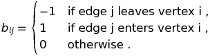

http://mathurl.com/

#### 22.1-8
* **What is the expected time to determine whether an edge is in the graph?**

O(1), because it takes constant work to find the vertex, and takes another constant work to find target vertex in the hash table  

* **What disadvantages does this scheme have?**

It takes more space.

* **Suggest an alternate data structure for each edge list that solves these problems.**

Can use BST which takes a bit less space.

* **Does your alternative have disadvantages compared to the hash table?**

BST is a compromise between list and hash table, it takes lg(Degree+(u)) time for update and search